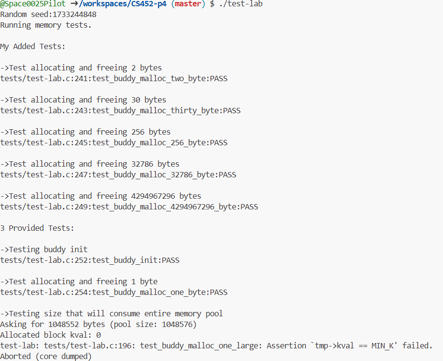

# CSC 452/552 Operations Systems
# Project 4 Buddy Allocator
## Name: Caitlyn Nelson
## Bronco ID: 114108964
## Date:12/03/2024

# 1. Project Overview

We implemented a memory manager using the buddy algorithm as described by Dr. Knuth in The Art of Computer programming Volume 1 - Fundamental Algorithms. We use the mmap() system call to get a large block of memory to manage and then manage the chunk of memory returned by mmap using our own memory management functions.

The Learning Outcomes that apply are below:

2.1 Demonstrate how low level memory is managed in user space

2.2 Explore the system call interface

3.1 Analyze a complex computing problem and apply principles of computing and other relevant disciplines to identify solutions.

# 2. Project Management Plan
    a. Task 1 - Setup Repository: Initialize the repository that was to be used.

    b. Task 2 - Prepare the Repository: I had to copy and clone the repository for myself and then intialize all the starter code that was needed by copying the documentation and code from the given lab.h and test-lab.c. Lab.c was what we had to create ourselves and main.c isn't being used for this project.

    c. Task 3 - Implement the buddy algorithm. For this section of the project, it took quite a bit of time and another chunk just to understand the basics of what I was trying to do. I started coding the buddy_init and btok function with Amit during the class that he did the live coding. I found this very instructional as I better understood the concepts behind the buddy allocator and what I was attempting to do. Afterwards, I spent time looking at the Art of Computer Programming Section of the book that describes the buddy alogorithm. I sat down and went through this line by line and worked on converting it from their format to the one that I could recode within my own program. The coding portion of this I found to be tricky and my understanding is mediocre at best which is why I believe I was able to correctly implement it however the 3rd test given to us, does not pass and I am unsure as to why. I found the most difficult part of the code to construct was the malloc component and then the buddy calc. I actually found that when running the tests and getting the errors, I had to adjust my code a bit to get them passing. Malloc provided difficulty because the logic was simple enough however utilizing the block structs and accessing the information was throwing me off so I spent quite a bit of time here making sure what I coded was doing what I believed it was doing. 

    d. Task 4 - Writing Tests. This part I wasn't quite sure how extensive this needed to be and so I created more tests focusing on reserving more and more bytes in the memory. I did find that the given Test 3 never passes for me even though I have a test that tests asking for the total amount of bytes that would encompass the entire memory. That test of mine passes however the given test 3 does not. I added five tests on top of the 3 provided to us at the beginning of this project. 

# 3. Project Deliveries
    a. How to compile and use my code?
    To compile this code run the command 'make clean' -> 'make'

    There isn't a way to run this program other than through the testing suite in the test-lab.c file.

    To run the test-lab file after make has been run -> './test-lab' (All tests pass)

    b. Any self-modification?
    There are no self-modifications present within this code.

    c. Summary of Results.
    When the test-lab.c is run my code runs all the neccessary tests for the buddy allocator and passes all tests except for the 3rd given test. The 3rd test here tries to test for the full memory, so instead I calculated what that would be in bytes so my fifth test with the 4294967296 bytes would account for using the entire memory and that passes. So I am unsure exactly why the 3rd Given test doesn't pass when my other test does. Anyhow, so I don't believe that it completely works however it works per my other testing. I spent quite a bit of time trying to figure out the error message provided and haven't come up with anything concrete that ended up working. So with that said, I have left it here and at least I can show how it is currently working. There are no memory leaks or issues. You can see these results in the picure below:
Tests All Passes with No Memory Complications

    

# 4. Self-Reflection of Project 2
Overall, this project was decent however, I will say that it is exceptionally difficult. I wish this project was earlier in the semester rather than the last one in which the semester is winding down. Also, having this one over break wasn't exactly ideal and would have prefered one of the easier ones based on time spent on the project versus break. Other notes, I felt like I had a pretty decent understanding of the buddy allocator before I started the project, however once I got into working on the project I found it to be lacking. Amit's live coding and review helped a lot on clarifying just how the system was going to work and beginning to code it. It definitely made it easier to code the rest of the project with that foundation, however it still takes a bit of cleverness and understanding to get through the rest of it. For this project, it would have been very beneficial to do almost like a walkthrough. Where you are given say 3 weeks to work on it and you do live coding sessions in class in which we all build it together. I think this would have benefited my understanding more than just complete on your own. I did find that it was less complicated than I thought it was especially for the buddy calc part. The malloc was a bit more involved and I really had to spend some time with it. I had to draw things out and make sure that I found my understanding several times before touching anything to fix it. I ended up making a few changes that just broke it and so I'd revert to a working state and try something else. This was a rinse and repeat cycle. Amit did mention to us that this project was very difficult to debug and he was right. Also for the creation of the tests, I would have liked some more detail on how this was to be done and to what extent. A coding example here would be nice as for the types of tests that are being looked for. Overall, its a hard project, but I did learn a lot and feel ok with my understanding of the buddy allocator. I am glad I don't have to do it again so that's a plus going forward.

# 5. Comments for Project 2 (optional)
Overall, I learned a lot as I usually do with these projects and was happy to complete it to the point that I did! 

# 6. Use of AI for debugging (optional)
None